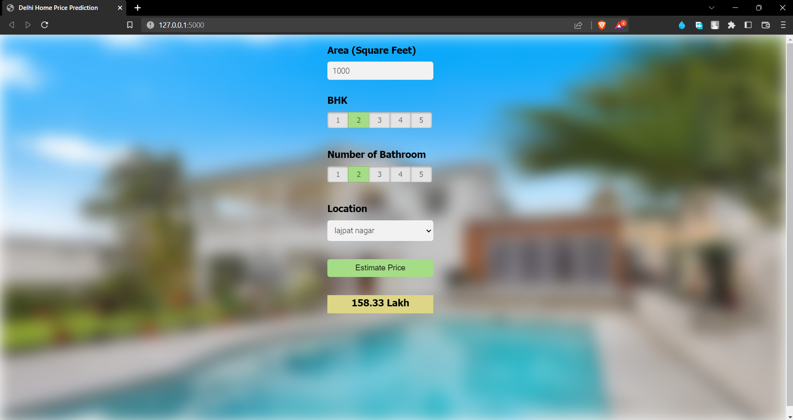

# Delhi Housing Price Prediction Web APP

## Introduction
Delhi Housing Price Prediction is a machine learning project that aims to predict the prices of houses in Delhi, India. This project uses a dataset consisting of various features such as the location, area, number of rooms, and other amenities to predict the prices of houses.

The goal of this project is to create a machine learning model that can accurately predict the prices of houses based on the input features. This project is useful for real estate companies and buyers who want to get an estimate of the prices of houses in Delhi.

## Live screenshot


### Requirements
This project requires the following libraries:

```
Python 3.6+
NumPy
Pandas
Scikit-learn
Matplotlib
Seaborn
```

## Installation
To install the required libraries, run the following command
```
pip install -r requirements.txt
```
## To run local server

Run the following command:
```
python main.py
```
### Resources
- [Dataset](https://www.kaggle.com/datasets/goelyash/housing-price-dataset-of-delhiindia)

